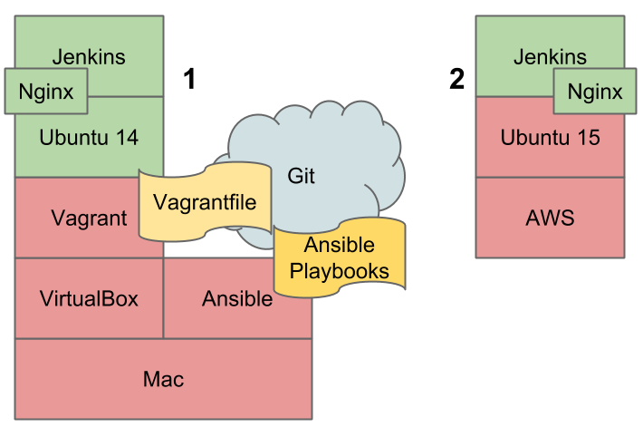

# Gestión de la configuración

**Instalar Jenkins CI automáticamente en entornos locales y remotos**

Esto es el resultado de un tutorial sobre gestión de configuración a través de la instalación automática de Jenkins CI. El contenido completo del tutorial lo compone:

* Youtube - https://goo.gl/ZJs5eY
* Github - https://github.com/carlessanagustin/install-jenkins
* Slideshare - http://www.slideshare.net/carlessanagustin/gestin-de-la-configuracin-jenkins-ci

**TODO EL TUTORIAL [AQUI](https://goo.gl/ZJs5eY)**

## 1. Arquitectura
(CM01b-intro-arquitectura)
https://goo.gl/hIRTFb

## 2. Software usado
(CM01c-intro-software)
http://goo.gl/sWWqBC

### Listado
* VirtualBox - https://www.virtualbox.org/
* Ansible - http://www.ansible.com/
* Vagrant - https://www.vagrantup.com/
* Ubuntu Linux - http://www.ubuntu.com/
* Jenkins CI - https://jenkins-ci.org/
* Nginx - http://nginx.org/
* Amazon AWS - https://aws.amazon.com/
* Git - https://git-scm.com/
* Github - https://github.com/
* SourceTree - https://www.sourcetreeapp.com/

## 3. Configurar Vagrant con su Vagrantfile
(CM02-vagrant-init)
http://goo.gl/9l5ZQJ

## 4. Crear el playbook de Ansible para la instalación de Jenkins CI
(CM03-ansible-playbook)

## 5. Refactorizar el playbook de Ansible con estructura de roles
(CM04-ansible-refactor-roles)

## 6. Redirección de puertos con Nginx
(CM05-nginx-jenkins-automatico)

## 7. Refactorizar el playbook de Ansible para aceptar Ubuntu 12
(CM06-refactoring-jdk7)

## 8. Instalar Jenkins CI automaticamente en SO de Amazon AWS
(CM07-aws-jenkins-automatico)

## 9. Compartir el código versionado en Github
(CM08-git_push-github)

Tutorial realizado por www.carlessanagustin.com

---

Tags: amazon, ansible, aws, git, github, jenkins, sourcetree, ubuntu, vagrant, virtualbox, tutorial
